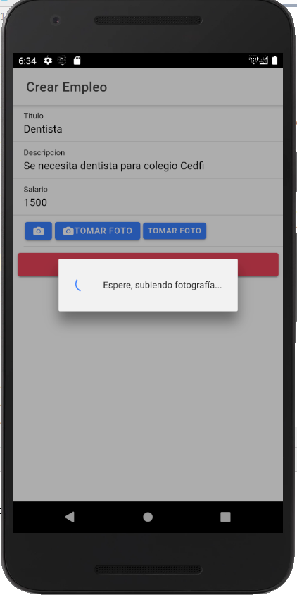
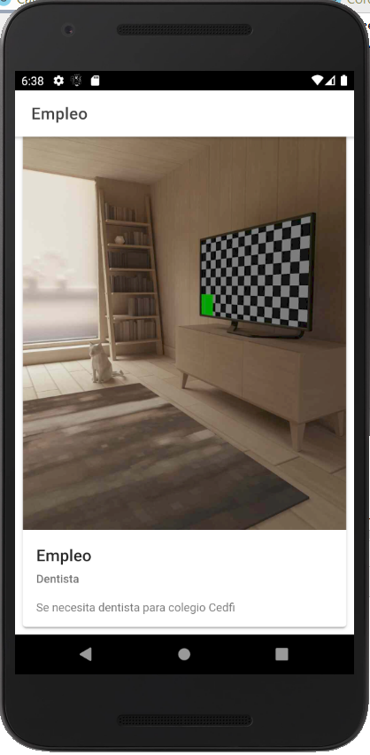
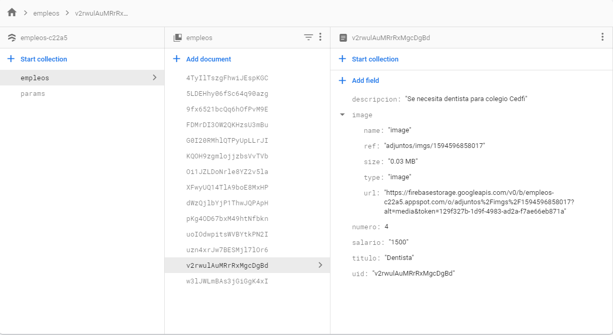
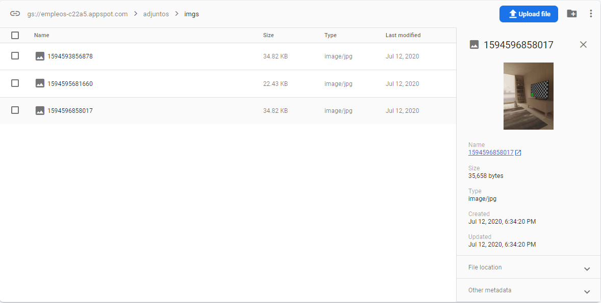

# App para Empleos

La siguiente app fue desarrollada en Ionic, misma que permite el registro de empleos y esta información se guarda en la base de datos de Firebase.

## Resultados

Imagen 1:
Descripcion: Registro de empleo en la app

Imagen 2:
Descripcion: Tomamos foto en la app para agregarle al empleo

Imagen 3:
Descripcion: Imagen cargandose en la BBDD

Imagen 4:
Descripcion: Visualizacion de empleo agregado con su respectiva imagen

Imagen 5:
Descripcion: Visualizacion de la BBDD con el nuevo empleo

Imagen 6:
Descripcion: Visualizacion del Firebase storage

