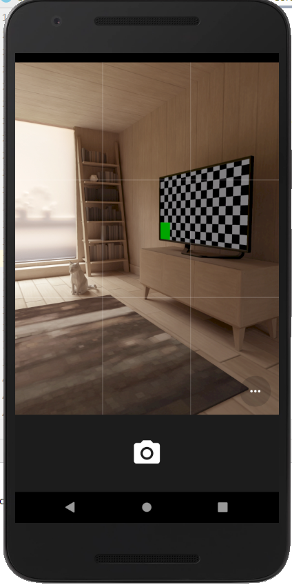

# App para Empleos

La siguiente app fue desarrollada en Ionic, misma que permite el registro de empleos y esta información se guarda en la base de datos de Firebase.

## Resultados

Imagen 1:
Descripcion: Registro de empleo en la app

Imagen 2:
Descripcion: Tomamos foto en la app para agregarle al empleo

Imagen 3:
Descripcion: Imagen cargandose en la BBDD

Imagen 4:
Descripcion: Visualizacion de empleo agregado con su respectiva imagen

Imagen 5:
Descripcion: Visualizacion de la BBDD con el nuevo empleo

Imagen 6:
Descripcion: Visualizacion del Firebase storage

---------------------------------------------------------------------------
# Plugin Chooser - Api Native
Este plugin permite seleccionar archivos desde la carpeta de archivos que se encuentra en el dispositivo que se este manejando actualmente, de tal manera que su correcta configuración permitirá seleccionar archivos de distintos formatos tales como jpg, png, pdf, war, entre otros. Este tipo de plugin soporta los sistemas operativos de Android e iOS.

## Instalación:

### Instalación en cordova:
        ionic cordova plugin add cordova-plugin-chooser
        npm install @ionic-native/chooser

### Instalación en capacitor
        npm install cordova-plugin-chooser
        npm install @ionic-native/chooser
        ionic cap sync

En nuestro caso vamos a utilizar la instalación del capacitor. Posterior a esta instalación lo que debemos realizar es la importación de librerías dentro del app module, además dentro de los providers como se presenta a continuación:

##Importación de API en el archivo app.modules.ts

        import { FileChooser} from '@ionic-native/file-chooser/ngx'
        providers: [
            StatusBar,
            SplashScreen,
            Camera,
            FileChooser,

            { provide: RouteReuseStrategy, useClass: IonicRouteStrategy},

          ],
  
## Generación del componente
Para su correcta implementación y utilización de manera recurrente se ha pretendido poner el método de optencion de archivos en un componente para que al momento de llamarlo desde distintas paginas sea reutilizado solo llamando al componente creado.
Para crear el componente a través de la linea de comando que se ejecutará en el terminal ponemos la siguiente linea de código:
ionic generate component components/file-chooser

###Configuración del componente file-chooser:
Para poder implementar el metodo de manera satisfactoria procedemos a configurar los siguientes archivos que se presentarán a continuación:

  ## file-chooser.component.ts
  Dentro de este archivo vamos a ubicar el metodo que será llamado desde cualquier página
  
        import { Component, OnInit, Input, Output, EventEmitter } from '@angular/core';
        import {FileChooser} from '@ionic-native/file-chooser/ngx'
        import { Observable } from 'rxjs';

        @Component({
          selector: 'app-file-chooser',
          templateUrl: './file-chooser.component.html',
          styleUrls: ['./file-chooser.component.scss'],
        })
        export class FileChooserComponent implements OnInit {
          files: Observable<any[]>
          @Input() icon:string;
          @Output() finishFile = new EventEmitter<any>();

          constructor(private fileChooser: FileChooser,) { }

          ngOnInit() {}
          currentFile: string = 'none';

          openChooser(){
            console.log('Opening chooser')
            this.fileChooser.open().then(uri => {

                console.log('File chosen: ', uri);
                this.currentFile = uri;
                this.finishFile.emit({msg: 'File is: ' + uri})
                alert('File is: ' + uri);
              })
              .catch(e => {
                console.log('Error choosing file: ', e);
              });

          }
          
  ## file-chooser.component.html
 En este archivo html llamamos al método openChooser(), el cual tendrá la siguiente información:
             <ion-button (click)="openChooser()">
              <ion-icon [name]="icon"></ion-icon>

              Escoger Archivo
            </ion-button>

## Implementación de Chooser en página:
Para la demostración de la implementación del componente con el plugin Chooser, he decidido implementar este componente en la creación de un empleo, ya que el usuario puede subir archivos que le solicite la página para poder validar su inscripción.

1) Implementar el componente dentro de la pagina.module.ts, en nuestro caso seria "crear-pagina.module.ts":
Lo que hago en esta seccion es llamar al componente creado denominado FileChooserComponent y ademas declararlo como se puede observar a continuación en las presentes lineas de código:

                            import {FileChooserComponent} from 'src/app/components/file-chooser/file-chooser.component';
                            @NgModule({
                              imports: [
                                CommonModule,
                                FormsModule,
                                IonicModule,
                                CrearEmpleoPageRoutingModule
                              ],
                              declarations: [CrearEmpleoPage, ImageUploadComponent, TestcomponentComponent,FileChooserComponent],
                              exports: [ImageUploadComponent, TestcomponentComponent,FileChooserComponent]

                            })
                            export class CrearEmpleoPageModule {}

2) Llamar al componente en el html de la página:
A continuación dentro del html de crear-empleo.page.html vamos a llamar a nuestro componente como muestra la siguiente linea de código:
<app-file-chooser [icon]="'upload'"></app-file-chooser>

Resultados:

